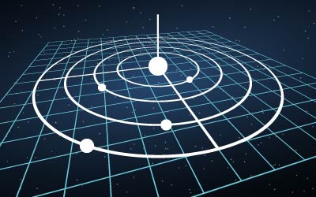
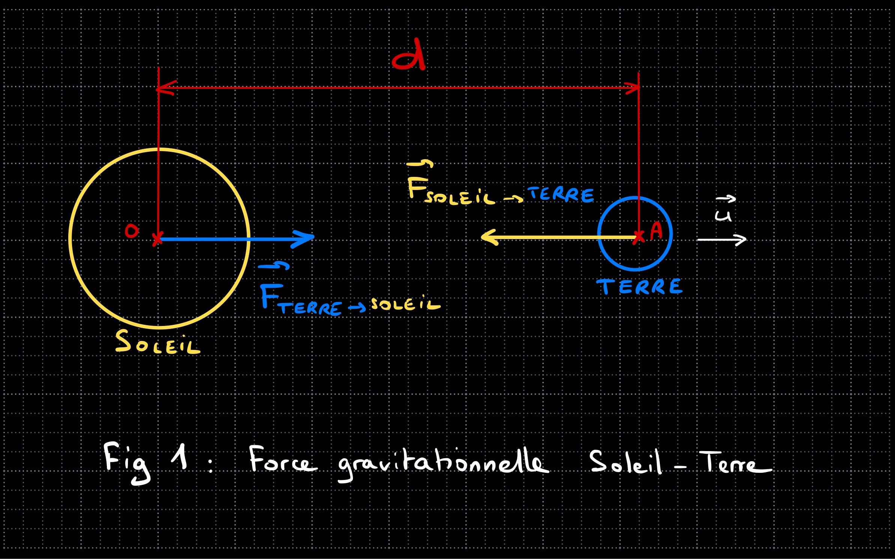
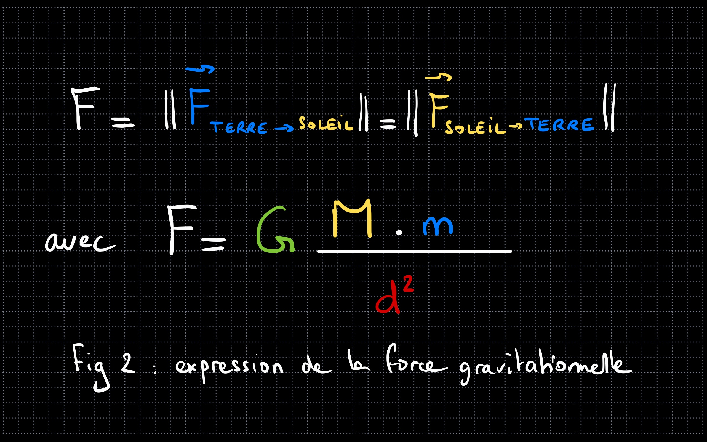
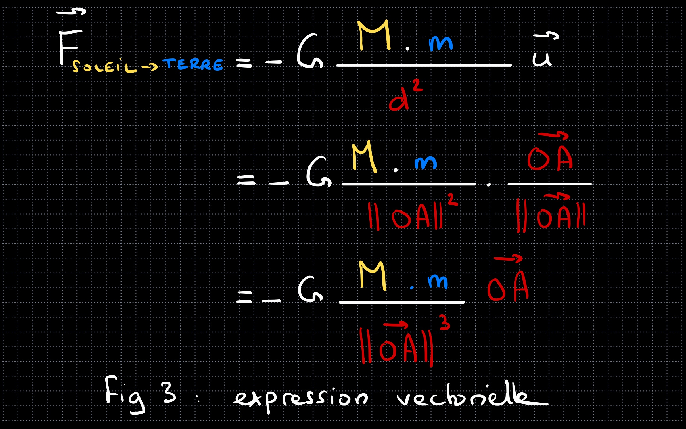
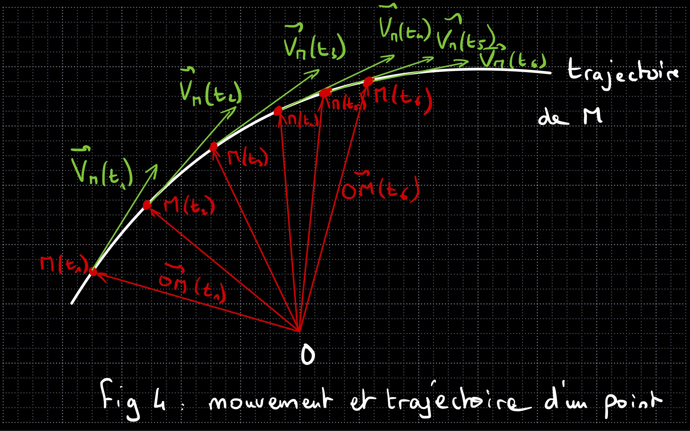
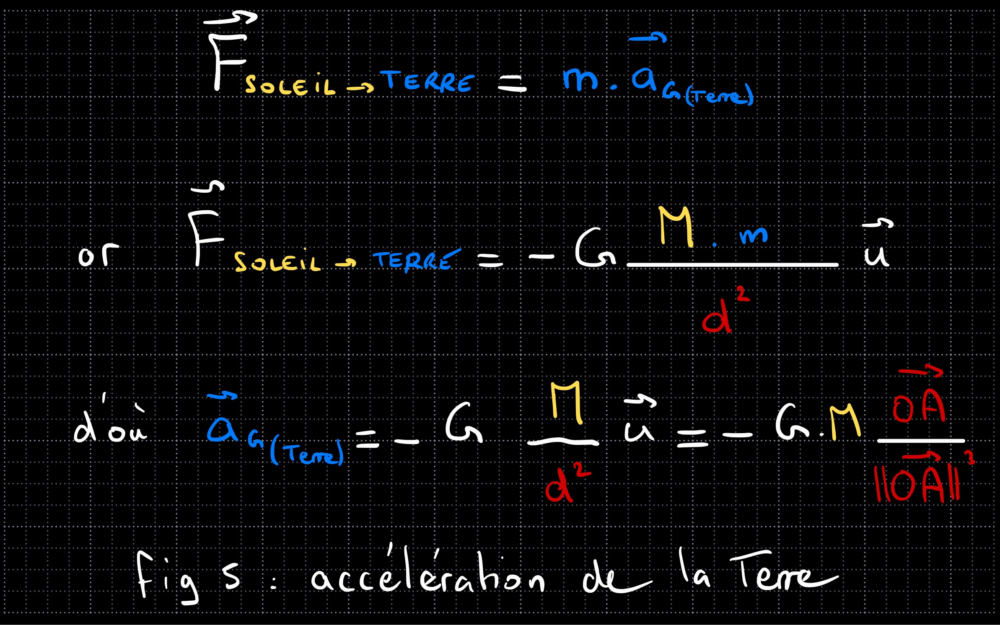
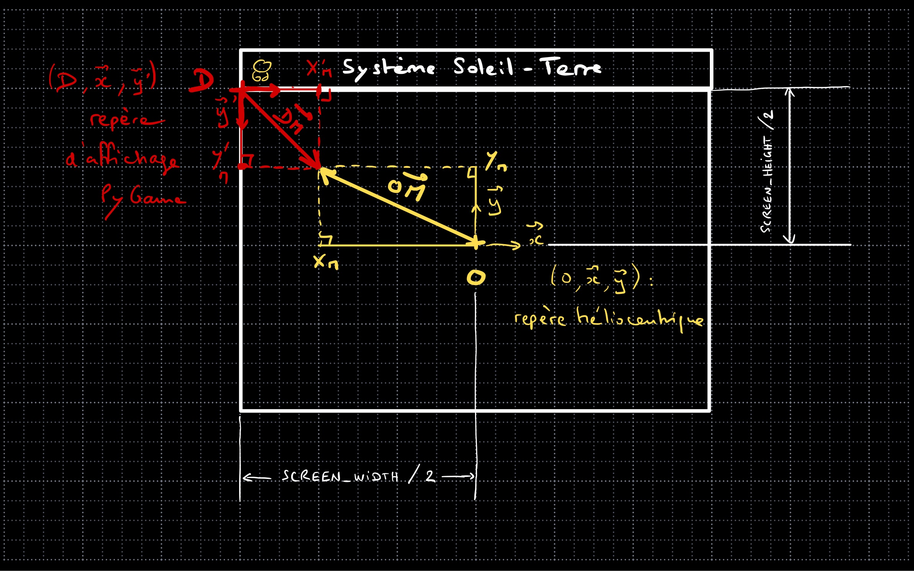
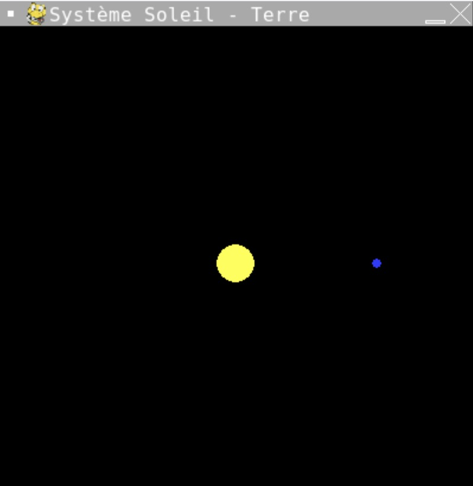
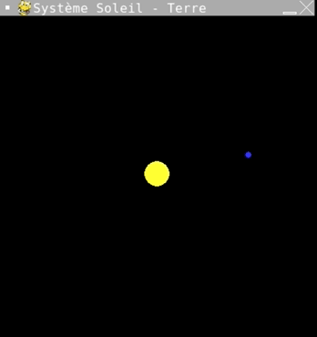

# Projet système solaire - Partie 1 individuelle
_L’objectif de cette première partie est de simuler l’orbite la planète Terre autour du Soleil à l’aide des équations du mouvement et de la théorie de la gravitation universelle de Newton, par un programme simple sous Pygame, puis de constater l'influence des paramètres initiaux sur les caractéristiques physiques de l'orbite._

_Dans la seconde partie du projet, en groupe, nous étendrons les notions abordées dans cette partie à tout le système solaire, en utilisant la POO bien adaptée à une généralisation, et l'API de l'IMCCE (L'Institut de mécanique céleste et de calcul des éphémérides) situé à l'Observatoire de Paris qui délivre les positions et vitesses réelles à un instant t._
  
  ## Objectif de cette partie
  1. **Simuler** les positions et vitesses d'une planète dans PyGame.
  2. **Utiliser** les vecteurs dans PyGame avec l'objet `pygame.math.Vector2`.
  3. **Valider** la précision de la simulation.
 



## Quelques concepts fondamentaux de mécanique gravitationnelle

_Pourquoi les planètes sont-elles en orbite autour du Soleil ? Vaste question..._

_Quelques rappels s'imposent... il est conseillé de prendre des notes par écrit, au moins pour les formules principales et les graphiques_.


### Attraction gravitationnelle
La loi qui décrit la chute des corps et le mouvement des corps céleste est appelée _loi universelle de la gravitation_, car elle est valable dans tout l'Univers. Elle a été établie par Newton en 1687.

Prenons l'exemple du Soleil et de la Terre de la fig.1 ci-dessous et posons quelques données :
- O centre du Soleil
- A centre de la Terre
- M = masse du Soleil (en kg)
- m = masse de la Terre (en kg)
- d = OA = distance entre le Soleil et la terre (en m),


La _loi universelle de la gravitation_ stipule que les deux corps s'attirent avec des forces ayant la même intensité (la norme des vecteurs forces) mais de sens opposé.

Cette intensité F s'exprime très simplement par cette formule :


où G est la constante de gravitation universelle :

  
C'est tout ce qu'il faut savoir en ce qui concerne l'attraction gravitationnelle pour l'instant !

> Remarque et application pour les curieux : Vous qui êtes assis sur votre chaise, êtes attirés par la Terre avec une force qui n'est autre que votre poids qui vaut P = m.g = m x 9,81 (où m est votre masse en kg). On peut retrouver facilement la valeur 9,81 en utilisant la loi universelle de la gravitation, avec d rayon de la Terre et M masse de la Terre et en effectuant l'application numérique des trois termes G, M et d au carré, vous obtiendrez 9,81, nommée accélération de la pesanteur sur Terre.
>
> 
### Écriture vectorielle, un peu de maths... mais pas trop !
Dans PyGame nous utiliserons des vecteurs pour manipuler plus facilement les positions, les vitesses, les accélérations et les forces. Il nous faudra donc définir un vecteur unitaire u de la droite (OA), c'est-à-dire un vecteur dont la direction est la droite (OA), le sens positif allant de O vers A et la norme valant 1.

Ce vecteur peut-être défini à tout instant grâce au vecteur :
 dont la norme n'est autre que la distance :


Il est alors simple de définir le vecteur unitaire grâce à la formule :


Si l'on écrit le vecteur force à l'aide de ce vecteur unitaire et qu'on remplace d par son expression vectorielle, on obtient cette formule :


L'avantage de cette formule c'est qu'elle n'utilise que les points O et A pour définir les caractéristiques géométriques du vecteur. On notera  l'exposant au cube du dénominateur.

>_Remarque : Il y aura  plusieurs possibilités d'écrire cette formule car PyGame propose de calculer le vecteur unitaire à partir de n'importe quel vecteur et propose même sa norme au carré ! Donc la formule avec le cube n'est pas obligatoire. Vous choisirez celle qui vous plaira._

## Le mouvement des corps
Voici quelques définitions qui permettent de décrire complètement le mouvement d'un point M quelconque. Nous aurons besoin de ces définitions pour faire se déplacer le centre de gravité la Terre.

### Définitions
- L’ensemble des positions occupées par un point M en mouvement se nomme la _trajectoire de M_.
- La _position_ du point M à un instant t sera donnée par le vecteur : 
O étant le centre du référentiel de l’espace. Dans notre cas, ce sera le Soleil.
- La _vitesse_ du point M caractérise la variation de position de ce point par rapport au temps. C’est donc la dérivée de la position par rapport au temps. Elle est toujours tangente à la trajectoire : 
- L’_accélération_ du point M caractérise la variation de vitesse de ce point par rapport au temps. C’est donc la dérivée de la vitesse par rapport au temps : 

### Conséquences et applications
- Si l’on connaît la vitesse d’un point à un instant t1 ainsi que son accélération au même instant, on pourra en déduire sa vitesse à l’instant t2, à condition que t1 et t2 soient très rapprochés.
- En effet, en considérant un intervalle de temps très petit _dt = t2 – t1_ on peut faire l'approximation que :

d'où

>_Remarque : En mathématiques, on manipule des quantités infinitésimales dt qu'il est impossible de reproduire en informatique. On fera donc une approximation en réduisant au maximum l'intervalle de temps afin que la simulation ne soit pas dégradée tout en ayant un affichage correct._
- De même, si l’on connaît la position d’un point à un instant t1 ainsi que sa vitesse au même instant, on pourra en déduire sa position à l’instant t2.
- En effet, en considérant un intervalle de temps très petit _dt = t2 – t1_ :

d'où

>_En résumé, il suffit de connaître l'accélération du point à chaque instant pour en déduire par ce procédé sa vitesse puis sa position à l'instant suivant._

Mais quel est le rapport avec la gravitation, le Soleil et la Terre ??? 


Nous y arrivons, grâce à cette troisième partie, qui va unifier tout ce que nous venons d'apprendre...
## Principe fondamental de la dynamique
Newton, encore lui, a énoncé trois lois dont la troisième est connue sous le nom de _Principe fondamental de la dynamique_ et que vous avez forcément vue en classe.

Sous forme vectorielle, on écrit :


>En français, elle s'énonce ainsi : _"La somme des forces extérieures appliquées à un corps de masse m est égal au produit de sa masse par l'accélération de son centre de gravité"_.

Mais alors ? Quel rapport avec la gravitation ?...

### Newton again... Mouvement des corps mus par l'attraction universelle

Newton, qui d'après la légende, était couché sous un arbre, se serait pris une pomme sur la tête. Or, dans le ciel la Lune était présente... Par un éclair de génie, il aurait compris que ce qui fait tourner la Lune autour de la Terre est ce qui faisait tomber la pomme sur le sol, c'était une seule et même force, la force gravitationnelle que nous avons vue dans la première partie.

> En résumé, seules les forces gravitationnelles engendrent les mouvements des planètes dans notre système solaire, et plus largement dans tout l'univers (si l'on néglige les collisions).
>
> Remarque : Nous ne prendrons pas non plus en compte la relativité générale d'Einstein, ni les concepts encore très théoriques d'énergie noire et de matière noire, que PyGame aurait un peu de mal à intégrer...

### Unification des formules
Essayons d'unifier tout ce que nous avons appris en revenant à notre couple Terre - Soleil :
- On applique à la Terre le principe fondamental de la dynamique en faisant l'hypothèse que la force la plus importante qu'elle subit est celle du Soleil (on néglige celle de la Lune et des autres planètes, ce qui induit une légère erreur, mais sans grave conséquences),
- on confronte cette force à sa définition gravitationnelle vue en première partie,
- on en déduit l'expression de l'accélération du centre de gravité de la Terre.

Voici le détail des calculs très simples :

Et voilà ! L'accélération du centre de gravité de la Terre ne dépend que de la masse du Soleil et de sa distance à ce dernier (au carré).

> **Remarque très importante** : on constate que la masse de la Terre a disparu !
>
> Ce n'est pas une erreur, en effet l'accélération des corps soumis à l'attraction gravitationnelle d'un autre corps ne dépend que de la masse du corps attracteur. On connaît cette propriété de la chute libre des corps dans le vide, comme le montre cette vidéo célèbre tournée lors de la mission Apollo 15, où l'astronaute David Scott lâche une plume et un marteau qui tombent au même moment sur le sol :
>

### Conclusion
Ainsi, connaissant :
- La masse du corps attracteur (ici le Soleil),
- la distance initiale de la Terre au Soleil,
- la vitesse initiale de la Terre par rapport au Soleil (supposé ayant une vitesse nulle dans un référentiel galiléen, lié aux étoiles),

il sera ainsi possible de calculer :
- l'accélération du centre de gravité de la Terre,
- la vitesse de la Terre à un instant suivant très rapproché,
- la position de la Terre à ce même instant suivant,

et donc sa trajectoire, qui n'est autre que son orbite !

THAT'S IT !

## Quand est-ce qu'on code ?

Maintenant... C'est parti !

## Remarques préalables
### Facteurs d'échelles pour les positions et les diamètres
Comme il est impossible de représenter simultanément les tailles des planètes et leur distance au Soleil, nous exagérerons leur diamètre apparent. Le Soleil étant nettement plus gros, il aura son propre facteur d'échelle.

Les calculs de position et de vitesse seront bien sûr réels, seuls les affichages seront mis à l'échelle.

Nous proposons que ces facteurs d'échelles soient liés aux dimensions de l'affichage de Pygame `SCREEN_WIDTH` et `SCREEN_HEIGHT`. Ainsi, si vous souhaitez augmenter ou diminuer la taille de cet affichage, il ne sera pas nécessaire de modifier les échelles.

Nous choisissons ces facteurs d'échelle :
- pour les distances : `SCREEN_HEIGHT * 2.0e-12`
- pour le rayon du Soleil : `SCREEN_HEIGHT * 3.0e-11`
- pour le rayon de la Terre et des planètes : `SCREEN_HEIGHT * 1.0e-9`

Toutes ces valeurs sont déjà écrites dans le code, ainsi que les constantes astronomiques, afin de gagner du temps.

### Origine et repère orthonormé

Nous travaillerons dans le plan du système solaire, appelé plan de l'écliptique.

On décide logiquement de choisir le centre du Soleil comme origine du repère (O, x, y) de notre plan et le Soleil sera au centre de l'écran.

Hélas, PyGame ne propose pas de changement d'origine au centre, son origine étant en haut à gauche avec y dirigé vers le bas. Nous devrons donc créer une fonction de changement de repère afin de ne pas avoir à nous préoccuper des contraintes informatiques liées à l'affichage.

## PyGame Vector2
Nos vecteurs n'auront donc que deux dimensions. PyGame propose une classe d'objet très commode appelée `Vector2` dont la documentation est [ici](https://www.pygame.org/docs/ref/math.html#pygame.math.Vector2).

Pour déclarer un vecteur u de composantes 4 sur x et -5 sur y, c'est très simple :
- Déclarer un vecteur : `u = pygame.Vector2(4, -5)`
> il n'est pas nécessaire d'invoquer `pygame.math.Vector2`, la contraction `pygame.Vector2` étant autorisée.

Une fois les vecteurs définis, il pourront être manipulés comme en mathématique :
- Additionner deux vecteurs : `u + v`
- Soustraire deux vecteur : `u - v` 
- Multiplier un vecteur par un scalaire k : `k * u`
- Diviser un vecteur par un scalaire k : `u / k`

Des attributs et méthodes sont également à connaître :
- Récupérer les coordonnées x et y d'un vecteur : `u.x` et `u.y`
- Récupérer la norme d'un vecteur : `u.magnitude()`
- Récupérer la norme au carré d'un vecteur : `u.magnitude_squared()`
- Récupérer le vecteur unitaire associé à un vecteur : `u.normalize()`

## Travail demandé
### Fonction de de mise à l'échelle et de changement de repère
_Sur la figure ci-dessus, la position du point M est définie par le vecteur OM dans le repère héliocentrique (O, x, y) qui est déjà mis à l'échelle de l'affichage (sinon, il ne tiendrait pas vraiment dans l'écran...)._

_On souhaite obtenir les coordonnées de ce point (en pixels) dans le repère d'affichage de PyGame (D, x, y'), en passant en paramètre d'une fonction non pas le vecteur OM, déjà à l'échelle de l'affichage, mais directement le vecteur position de la planète en dimensions réelles (en m)._


1. **Compléter** la fonction `coordVecteurPygame(vecteur_heliocentrique)` qui accepte en paramètre un vecteur position en dimensions réelles (en m) dans le repère héliocentrique (O, x, y) dont le Soleil est l'origine et qui retourne un tuple des coordonnées (en pixels) dans le repère (D, x, y') prêtes à être utilisées sur l'affichage de PyGame.

> Conseil 1 : Il faut utiliser la relation de Chasles en écrivant :
>
> et sachant que vecteur DO est déjà défini dans le code `DO = pygame.Vector2(SCREEN_WIDTH / 2, SCREEN_HEIGHT / 2)`.
> 
> Conseil 2 : Il faut bien entendu utiliser le facteur d'échelle `echelleDistances` pour calculer le vecteur OM à partir de `vecteur_heliocentrique`. 

### Initialisation des vecteurs position, vitesse et accélération
Le code des questions suivantes sera complété après les commentaires :
```python
# Définition des vecteurs du mouvement de la planète
# À compléter avec les vecteurs pos, vit et acc :
```
2. **Initialiser** le vecteur position `pos` de la Terre grâce à sa distance `d0` déjà déclarée dans le code, sachant qu'on souhaite initialiser sa position à droite du Soleil, sur l'axe des x.
3. **Initialiser** le vecteur vitesse `vit` de la Terre grâce à sa vitesse initiale `v0` déjà déclarée dans le code, sachant le vecteur vitesse est vertical et orienté vers le haut, donc en y+. En effet, le vecteur vitesse est toujours tangent à la trajectoire qui dans le cas de la Terre est quasi-circulaire.
4. **Initialiser** le vecteur accélération `acc` de la Terre par un vecteur nul, car pour l'instant nous ne connaissons pas sa valeur.

### Dessin du Soleil et de la Terre
Le code de la question suivante sera complété dans la boucle infinie du jeu, après le commentaire :
```python
# Dessin du Soleil
```

5. **Dessiner** le Soleil par un disque de couleur prédéfinie `YELLOW` à l'aide de la commande `pygame.draw.circle`, du tuple de coordonnées d'affichage du Soleil obtenu grâce au retour de l'appel à la fonction `coordVecteurPygame(pygame.Vector2(0,0))` et de son rayon `R`.
> Attention, cette fonction a besoin d'un diamètre (voir sa documentation ou le TP sur le TP sur les virus en POO).

Le code de la question suivante sera complété dans la boucle infinie du jeu, après le commentaire :
```python
# Dessin de la planète
```

6. **Dessiner** la Terre par un disque de couleur prédéfinie `BLUE` à l'aide de la commande `pygame.draw.circle`, du tuple de coordonnées d'affichage de la Terre obtenu grâce au retour de l'appel à la fonction `coordVecteurPygame(pos)` et de son rayon `r`.

Si tout s'est bien passé, on doit obtenir cette figure :

Nous n'aurons plus à toucher à ces deux instructions à l'avenir car la boucle infinie du jeu raffraîchit l'affichage en permanence.

L'objectif est donc de faire varier le vecteur position `pos` au cours du temps, uniquement grâce à la _loi universelle de la gravitation_ et au _principe fondamental de la dynamique_ que nous avons vus précédemment.

## Mise en mouvement rectiligne uniforme de la Terre
_Nous allons tester le comportement de la Terre si on enlevait soudainement le Soleil, hypothèse totalement farfelue..._

_Dans ce cas, l'accélération resterait nulle puisqu'aucune force ne viendrait perturber le mouvement initiale de la Terre et la vitesse resterait constante._

Le code de la question suivante sera complété dans la boucle infinie du jeu, après le commentaire :
```python
 # Position de la planète
```
7. **Modifier** le vecteur position `pos` de la Terre en lui ajoutant simplement la variation due à la vitesse, en se rappelant que :

Si tout va bien (enfin pas tant que ça pour ses habitants...), la Terre s'est enfuie verticalement vers le haut à vitesse constante.
On pourra réduire le taux de rafraîchissement à 10 img/s pour ralentir l'affichage.
## Mise en mouvement rectiligne uniformément varié de la Terre
_Toujours de manière totalement farfelue, nous allons voir ce qu'il se passerait si la Terre était accélérée vers le haut, comme si elle était attirée par une force mystérieuse selon l'axe des y..._

_Dans ce cas, l'accélération sera maintenue constante, mais la vitesse ne le sera forcément plus..._

Le code de la question suivante sera complété dans la boucle infinie du jeu, après le commentaire :
```python
 # Accélération de la planète
```
8. **Modifier** le vecteur accélération `acc` de la Terre par une valeur constante en y, par exemple 2 m.s-2 : `pygame.Vector2(0, 2)`.

Si l'on exécute à nouveau le code, il n'y a eu aucun changement, car nous n'avons pas modifié le vecteur vitesse.

Le code de la question suivante sera complété dans la boucle infinie du jeu, après le commentaire :
```python
 # Vitesse de la planète
```
9. **Modifier** le vecteur vitesse `vit` de la Terre en lui ajoutant simplement la variation  due à l'accélération, en se rappelant que :


Nous constatons que la Terre s'enfuie de plus en plus vite, ce qui est tout à fait normal puisque son mouvement est accéléré.

### Mise en orbite de la Terre grâce à l'attraction du Soleil
_Tout est enfin en place pour faire intervenir le Soleil. En effet, si l'on remplace le vecteur accélération par celui que nous avons calculé précédemment (voir fig. 5), nous devrions voir l'effet de l'attraction gravitationnelle du Soleil sur la Terre._

Le code de la question suivante sera complété dans la boucle infinie du jeu, après le commentaire :
```python
 # Accélération de la planète
```
10. **Supprimer** la valeur `pygame.Vector2(0, 2)` du vecteur `acc` et la **remplacer** par le calcul de l'accélération due à l'attraction du Soleil, en se rappelant que :

>Conseils : on pourra utiliser au choix la première formule grâce à la méthode `normalize()` qui donne directement un vecteur unitaire à partir d'un vecteur dont il partagera la direction et le sens, combinée à `magnitude_squared()` qui donne directement la norme au carré d'un vecteur ; ou on pourra utiliser la seconde formule en  divisant simplement le vector `pos` par sa norme `magnitude()` au cube.

Si tout s'est bien passé, vous pourrez vous prendre pour Galilée s'exclamant "E pur si muove ! " et vous devriez obtenir ceci :


**Appel prof**


## Modification des paramètres de la simulation
_Notre Terre tourne, c'est bon signe, son orbite semble circulaire, c'est aussi très bon signe._

_Mais que ce passerait-il si la vitesse initiale n'était pas de 29,8 km/s mais de seulement 20 km/s ?_

11. **Modifier** la vitesse initiale `v0` à `20e3` m/s et **observer** le comportement très elliptique de la Terre qui aurait certainement un très chaud en certaines périodes de l'année avec une sévère accélération...

## Validation de la simulation
_Le grand axe de l'orbite elliptique semble se décaler doucement vers le bas au fur et à mesure des révolutions, ce qui n'est pas normal. Cela est dû à notre dt qui n'est sûrement pas assez petit._

_Nous allons toutefois le conserver afin de vérifier si le temps qui s'est écoulé au bout d'une orbite (normale) de la Terre fait bien une année._

_Pour cela nous allons mesurer en permanence l'angle `theta` entre le vecteur position de la Terre et son axe de départ, à savoir (O, x)._

12. **Rétablir** la vraie vitesse initiale de la Terre à `29.8e3`.

Le code de la question suivante sera complété dans la boucle infinie du jeu, après le commentaire :
```python
 # Calcul de l'angle entre pos et Ox
```

13. **Rechercher** dans la documentation de [PyGame.Vector2](https://www.pygame.org/docs/ref/math.html#pygame.math.Vector2) quelle méthode permet de calculer un angle entre un vecteur et un autre puis **appliquer** cette méthode au vecteur `pos` afin de calcule l'angle theta entre ce vecteur et le vecteur `Ox` déjà défini par `Ox = pygame.Vector2(1, 0)`.

Le code de la question suivante sera complété dans la boucle infinie du jeu, après le commentaire :
```python
 # # Détection et comptage des orbites
```
14. **Écrire** le code permettant de détecter une orbite complète, incrémenter le numéro de l'orbite ainsi que le nombre de jours écoulé au total.
>On affichera le résultat dans la console qui devrait ressembler à ceci :
>```python
>1 orbite.s effectuée.s en 365.0 jours
>2 orbite.s effectuée.s en 730.0 jours
>3 orbite.s effectuée.s en 1095.0 jours
>4 orbite.s effectuée.s en 1460.0 jours
>...
>```

> Conseil 1 : il faudra utiliser un angle `thetaPrecedent` à initialiser après le commentaire :
>```python
># Initialisation de l'angle thetaPrecedent entre pos et Ox
>```
>Conseil 2 : on a déjà initialisé deux variables `i`pour le comptage des itérations et `nbOrbites` pour le nombre des orbites.
### Pour aller plus loin
15. **Afficher** le vecteur vitesse à une échelle à déterminer (un segment suffira, pas besoin de flèche).
16. **Dessiner** la trajectoire de la Terre sous forme de petits points espacés, comme une queue de comète ou de serpent dans le jeu snake.
